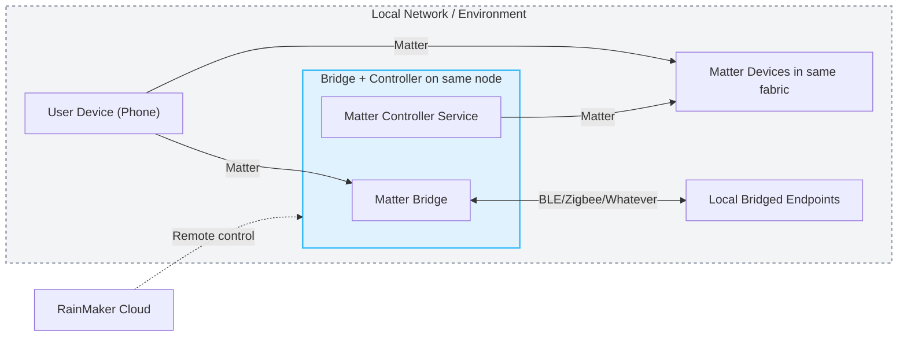

# Matter Bridge + Controller Example

## What this example demonstrates

This example runs two Matter roles on the same node:

- A **virtual** Matter bridge that exposes local bridged endpoints on that server node (based on [bridge_cli](https://github.com/espressif/esp-matter/tree/main/examples/bridge_apps/bridge_cli)).
- A Matter controller service exposed through the RainMaker `MatterCTL` service.

## Workflow / Architecture

### Mermaid Diagram



- Controller invoke-cmd works for other nodes in the same fabric.
- Controller invoke-cmd cannot reach local bridged endpoints on the same node.

### Controller NOC Installation Workflow

After the device has already been commissioned as a Matter bridge into a local fabric, the controller service upgrades that same node with controller capability.

1. The bridge is commissioned into a Matter fabric first.
2. Once `MatterCTL.BaseURL` and `MatterCTL.UserToken` are configured, the controller service fetches an access token from RainMaker.
3. The controller service inspects the local commissioned fabric table and auto-discovers the matching `RMakerGroupID`.
4. The controller service fetches the controller certificates from RainMaker and installs the controller NOC onto that same commissioned bridge fabric.
5. The service reports the issued controller node id through `MatterCTL.MatterNodeID`.
6. The installed controller node id is then used for subsequent controller-side operations in that fabric.

> [!NOTE]
> Send `MatterCTL.MTCtlCMD = 2` to force reinstall the controller NOC, e.g. `esp-rainmaker-cli setparams --data '{"MatterCTLSetup":{"MatterCTL": 2}}' <controller-rmaker-node-id>`.

This is what a successful startup NOC installation looks like in the logs:

```text
I (1756984) esp-x509-crt-bundle: Certificate validated
I (1757744) matter_noc: Fetched RCAC DER (479 bytes)
I (1757964) esp-x509-crt-bundle: Certificate validated
I (1758874) matter_noc: Issued controller NOC for controller node 0x02F721CE3CC52E60
I (1758874) matter_noc: Using node id 0x02F721CE3CC52E60 from issued controller NOC
I (1758884) chip[FP]: Validating NOC chain
I (1759214) chip[FP]: NOC chain validation successful
I (1759214) chip[FP]: Updated fabric at index: 0x2, Node ID: 0x02F721CE3CC52E60
I (1759214) chip[TS]: Last Known Good Time: 2026-04-13T12:17:17
I (1759214) chip[TS]: New proposed Last Known Good Time: 2026-04-14T03:24:09
I (1759214) chip[TS]: Updating pending Last Known Good Time to 2026-04-14T03:24:09
I (1759244) chip[FP]: Metadata for Fabric 0x2 persisted to storage.
I (1759244) chip[TS]: Committing Last Known Good Time to storage: 2026-04-14T03:24:09
I (1759264) chip[ZCL]: OpCreds: Fabric index 0x2 was committed to storage. Compressed Fabric Id 0x7BF5E3394D95388C, FabricId 66D7C7BCBB94700F, NodeId 02F721CE3CC52E60, VendorId 0x131B
I (1759264) chip[DIS]: Updating services using commissioning mode 0
I (1759274) chip[DIS]: Advertise operational node A8E9B9917751F43C-0000000024857656
I (1759274) chip[DIS]: Advertise operational node 7BF5E3394D95388C-02F721CE3CC52E60
I (1759274) matter_noc: Installed controller NOC for node 0x02F721CE3CC52E60
I (1759284) esp_rmaker_param: Reporting params: {"MatterCTL":{"RMakerGroupID":"EpPQ8N5fXcD9JeF7MvEYxj","MatterNodeID":"02F721CE3CC52E60","MTCtlStatus":127}}
I (1759284) esp_rmaker_param: Reporting params: {"MatterCTL":{"MTCtlStatus":127}}
```

## Usage

> [!IMPORTANT]
> This example is built with [ESP-IDF v5.5.3](https://github.com/espressif/esp-idf/tree/v5.5.3) and [esp-matter v1.5](https://github.com/espressif/esp-matter/tree/release/v1.5).

Follow the [parent Matter examples README](https://github.com/Sped0n/esp-rainmaker/tree/controller-with-dummy-bridge/examples/matter) for environment setup and general build prerequisites.

For the Python CLIs used below, it is recommended to use [pipx](https://github.com/pypa/pipx) instead of installing them into the ESP-IDF Python environment, because their dependencies may conflict with the ESP-IDF toolchain. Install [pipx](https://github.com/pypa/pipx) first if needed:

```bash
# macOS
brew install pipx
pipx ensurepath

# Ubuntu
sudo apt install pipx
pipx ensurepath

# Windows
scoop install pipx
pipx ensurepath
```

### 1. Claim the device

Remember to login using `esp-rainmaker-cli` first (`pipx run esp-rainmaker-cli login` or run it without [pipx](https://github.com/pypa/pipx)).

```bash
pipx run esp-rainmaker-cli claim --matter <port>

# or just run directly
esp-rainmaker-cli claim --matter <port>
```

### 2. Generate the fctry partition

```bash
pipx run esp-matter-mfg-tool --vendor-id 0x131B --product-id 0x2 \
                             --vendor-name "Espressif" --product-name "RainMaker-Matter-Bridge-Controller" \
                             --hw-ver-str "DevKitM1" \
                             -cd $RMAKER_PATH/examples/matter/mfg/cd_131B_0002.der \
                             --csv $RMAKER_PATH/examples/matter/mfg/keys.csv \
                             --mcsv $RMAKER_PATH/examples/matter/mfg/master.csv

# or just run directly
esp-matter-mfg-tool --vendor-id 0x131B --product-id 0x2 \
                    --vendor-name "Espressif" --product-name "RainMaker-Matter-Bridge-Controller" \
                    --hw-ver-str "DevKitM1" \
                    -cd $RMAKER_PATH/examples/matter/mfg/cd_131B_0002.der \
                    --csv $RMAKER_PATH/examples/matter/mfg/keys.csv \
                    --mcsv $RMAKER_PATH/examples/matter/mfg/master.csv
```

### 3. Flash the generated fctry partition

This example's `partitions.csv` places the `fctry` partition at `0x700000`.

```bash
esptool.py write_flash 0x700000 out/131b_2/<node_id>/<node_id>-partition.bin
```

### 4. Pair the device and update controller params

Use the QR code generated by `esp-matter-mfg-tool` to pair the device (`out/131b_2/<node_id>/<node_id>-qrcode.png`).

**User currently need to choose pairing method depends on which side of this demo you want to develop on**:

#### 4a. Pair with Apple Home app

> [!WARNING]
> Controller feature in this demo will not be available because the controller NOC flow relies on RainMaker.

Choose this if you want to develop **bridge-related** features, user can use [bridge command](#matter-esp-bridge) to test.

#### 4b. Pair with RainMaker iOS app

> [!WARNING]
> Bridge feature in this demo will not be available because RainMaker does not support Matter bridge devices yet.

Choose if you want to develop **controller-related** features, user can use [dev_mgr command](#matter-esp-devmgr) and [controller command](#matter-esp-bridge) to test.

After the device is paired in the RainMaker phone app:

1. Open the device detail page.
2. Go to `Controller > Update Params`.
3. Click `Update`.

This will configure `BaseURL` and `UserToken` of the RainMaker Matter controller service (`MatterCTL`).

## Device Console

After the controller service is configured and the startup NOC workflow completes, the device console exposes below commands.

### `matter esp dev_mgr`

Use this command group to inspect the current device list known to the controller logic.

```Bash
matter esp dev_mgr print
```

This prints the cached device list, including node ids, endpoint ids, device types, and online state for the remote Matter nodes discovered in the current RainMaker/Matter fabric.

```text
I (10764364) MATTER_DEVICE: device 0 : {
I (10764364) MATTER_DEVICE:     rainmaker_node_id: ZfwQernwycExP2AKX5ZGmR,
I (10764364) MATTER_DEVICE:     matter_node_id: 0x5F58196033542B80,
I (10764374) MATTER_DEVICE:     is_rainmaker_device: false,
I (10764374) MATTER_DEVICE:     is_online: true,
I (10764374) MATTER_DEVICE:     endpoints : [
I (10764374) MATTER_DEVICE:         {
I (10764374) MATTER_DEVICE:            endpoint_id: 1,
I (10764374) MATTER_DEVICE:            device_type_id: 0x10d,
I (10764374) MATTER_DEVICE:            device_name: ESP32C3,
I (10764374) MATTER_DEVICE:         },
I (10764374) MATTER_DEVICE:     ]
I (10764374) MATTER_DEVICE: }
```

### `matter esp controller`

Use this command group for controller interactions with other Matter nodes in the same fabric.

Examples:

```bash
# Basic commands
matter esp controller read-attr <matter_node_id> <endpoint_id> <cluster_id> <attribute_id>
matter esp controller write-attr <matter_node_id> <endpoint_id> <cluster_id> <attribute_id> <value>
matter esp controller invoke-cmd <matter_node_id> <endpoint_id> <cluster_id> <command_id> [command_data]

# e.g. toggle a matter light
matter esp controller invoke-cmd <matter_node_id> 1 6 2
```

Use these commands to inspect or operate Matter devices (like [Matter light example](https://github.com/Sped0n/esp-rainmaker/tree/master/examples/matter/matter_light)) that the local controller can reach through the fabric.

### `matter esp bridge`

Use this command group to inspect the virtual bridge and manage bridged endpoints for test setup.

Examples:

```bash
# List supported bridged device types
matter esp bridge support

# List all the bridged devices
matter esp bridge list

# Add bridged device with specific device type
matter esp bridge add <aggregator_endpoint_id> <device_type_id>

# Remove bridged device on an endpoint
matter esp bridge remove <endpoint_id>

# Reset the Bridge, clear all the bridged endpoints and factory-reset
matter esp bridge reset
```
